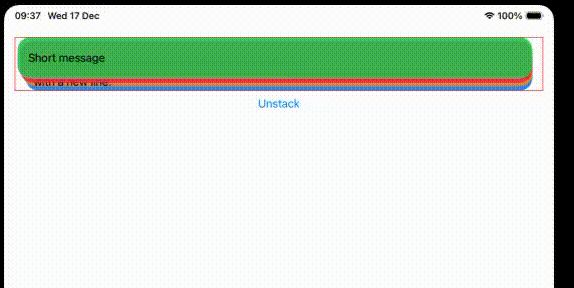

# SwiftUI-Stacking-Cards
SwiftUI - stacking views like the notifications on the Lockscreen
# SwiftUI Stacking Cards - iOS Lock Screen Style

A SwiftUI implementation of stacking card animations inspired by iOS Lock Screen notifications. Features smooth stack/unstack transitions with dynamic height management and cascading animations.

## 🎬 Demo



> Smooth transitions between stacked and expanded states with dynamic card heights

## ✨ Features

- 🔒 **iOS Lock Screen Style** - Mimics the native iOS notification stacking behavior
- 📐 **Dynamic Height Adaptation** - Cards automatically adjust to content size
- 🌊 **Cascading Animations** - Smooth waterfall effect when expanding/collapsing
- 🎯 **Perfect Alignment** - Maintains consistent positioning during transitions
- ⚡ **Performant** - Uses SwiftUI's preference keys for efficient height measurements
- 🎨 **Customizable** - Easy to modify colors, spacing, and animation timing

## 📱 Requirements

- iOS 15.0+
- Xcode 13.0+
- Swift 5.5+

## 🚀 Quick Start

1. Copy the source files to your SwiftUI project
2. Use in your view:
```swift
import SwiftUI

struct ToDoItemModel: Identifiable, Hashable {
    let id = UUID()
    var color: Color
    var message: String
}

// MARK: - Measure heights
struct CardHeightKey: PreferenceKey {
    static var defaultValue: [UUID: CGFloat] = [:]
    static func reduce(value: inout [UUID: CGFloat], nextValue: () -> [UUID: CGFloat]) {
        value.merge(nextValue(), uniquingKeysWith: { $1 })
    }
}

struct ToDoItemView: View {
    let item: ToDoItemModel
    let fixedHeight: CGFloat?
    let clipContent: Bool

    var body: some View {
        VStack(alignment: .leading, spacing: 8) {
            Text(item.message)
                .fixedSize(horizontal: false, vertical: true)
        }
        .padding(16)
        .frame(maxWidth: .infinity, alignment: .leading)
        .frame(height: fixedHeight, alignment: .top) // Align to top for smoother expansion
        .background(item.color.opacity(0.9))
        .clipShape(RoundedRectangle(cornerRadius: 20, style: .continuous))
        .clipped(antialiased: clipContent)
        .background(
            GeometryReader { proxy in
                Color.clear.preference(key: CardHeightKey.self, value: [item.id: proxy.size.height])
            }
        )
        .animation(.spring(response: 0.6, dampingFraction: 0.8), value: fixedHeight) // Animate height changes
    }
}

struct ContentView1: View {
    @State private var stacked = true
    @State private var heights: [UUID: CGFloat] = [:]

    let todos: [ToDoItemModel] = [
        .init(color: .green,  message: "Short message"),
        .init(color: .pink,   message: "This is a longer message that will make the cell taller."),
        .init(color: .orange, message: "Medium message\nwith a new line."),
        .init(color: .blue,   message: "Very very long message... Very very long message... Very very long message...")
    ]

    private let stackStep: CGFloat = 6
    private let spacing: CGFloat = 12
    
    // Maximum padding used by the last card when stacked
    private var maxHorizontalPadding: CGFloat {
        CGFloat(todos.count - 1) * 4 + 4
    }

    private func height(of item: ToDoItemModel) -> CGFloat? {
        heights[item.id]
    }
    
    // Height of the first card (used as standard for stacking)
    private var firstCardHeight: CGFloat? {
        guard let firstItem = todos.first else { return nil }
        return height(of: firstItem)
    }

    private func unstackOffset(for index: Int) -> CGFloat {
        guard index > 0 else { return 0 }
        var y: CGFloat = 0
        for i in 0..<index {
            if let h = height(of: todos[i]) {
                y += h + spacing
            }
        }
        return y
    }

    private func yOffset(for index: Int) -> CGFloat {
        stacked ? CGFloat(index) * stackStep : unstackOffset(for: index)
    }

    // Leading padding when stacked (increases with index)
    private func leadingPadding(for index: Int) -> CGFloat {
        stacked ? (CGFloat(index) * 4 + 4) : maxHorizontalPadding
    }
    
    // Trailing padding to maintain consistent card width
    private func trailingPadding(for index: Int) -> CGFloat {
        stacked ? maxHorizontalPadding : maxHorizontalPadding
    }
    
    // Fixed height for cards when stacked (all use first card's height)
    private func cardFixedHeight(for index: Int) -> CGFloat? {
        guard stacked, let firstHeight = firstCardHeight else { return nil }
        return firstHeight
    }

    private var containerHeight: CGFloat {
        if stacked {
            // All cards use first card's height when stacked
            if let firstHeight = firstCardHeight {
                return firstHeight + CGFloat(max(todos.count - 1, 0)) * stackStep
            }
        } else {
            // Use actual heights when unstacked
            let total = todos.reduce(CGFloat(0)) { sum, item in
                sum + (height(of: item) ?? 0)
            }
            if total > 0 {
                return total + CGFloat(max(todos.count - 1, 0)) * spacing
            }
        }
        // Fallback while heights are being measured
        return 200
    }

    var body: some View {
        VStack {
            GeometryReader { _ in
                ZStack(alignment: .top) {
                    ForEach(Array(todos.enumerated()), id: \.1.id) { index, item in
                        ToDoItemView(
                            item: item,
                            fixedHeight: cardFixedHeight(for: index),
                            clipContent: stacked && firstCardHeight != nil
                        )
                        .padding(.leading, leadingPadding(for: index))
                        .padding(.trailing, trailingPadding(for: index))
                        .offset(y: yOffset(for: index))
                        .zIndex(Double(todos.count - index))
                        .animation(
                            .spring(response: 0.6, dampingFraction: 0.8)
                            .delay(Double(index) * 0.05), // Stagger animation by 0.05s per card
                            value: stacked
                        )
                    }
                }
            }
            .frame(height: containerHeight)
            .animation(.spring(response: 0.6, dampingFraction: 0.8), value: containerHeight)
            .onPreferenceChange(CardHeightKey.self) { newHeights in
                heights = newHeights
            }
            .border(.red)

            Button(stacked ? "Unstack" : "Stack") {
                withAnimation(.spring(response: 0.6, dampingFraction: 0.8)) { 
                    stacked.toggle() 
                }
            }

            Spacer()
        }
        .padding()
    }
}

#Preview {
    ContentView1()
}
